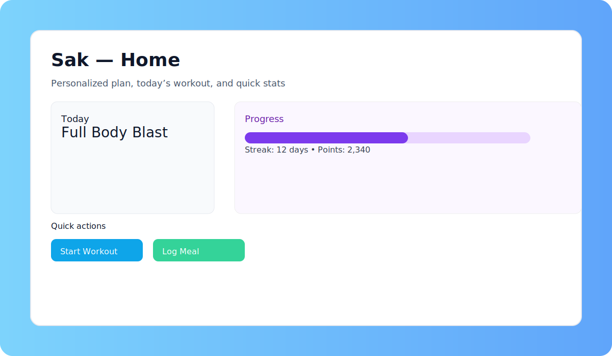
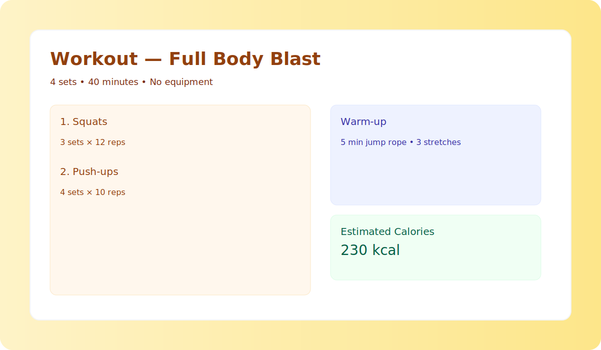
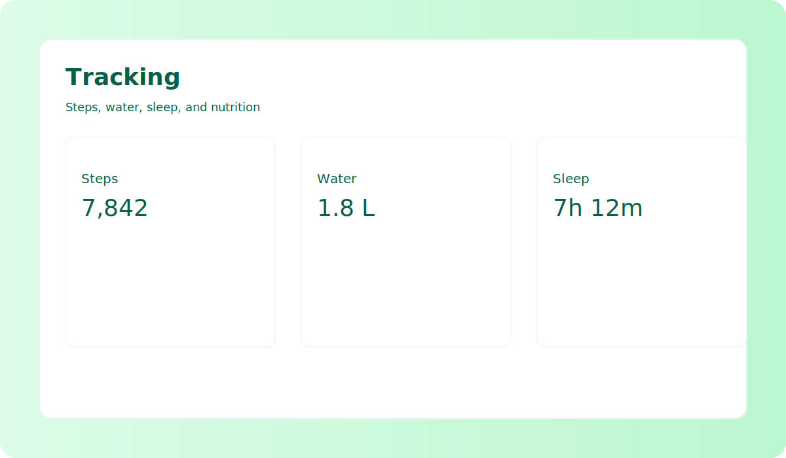

# Sak - Your Personal AI Trainer 💪

AI-powered Fitness & Wellness App that creates custom workout and diet plans for you. Sak uses lightweight on-device models and optional cloud sync to deliver personalized training, habit coaching, and progress tracking — whether you want to build strength, lose weight, or improve overall wellbeing.

## ✨ Features
- **Workout plan** - Personalized exercise routines based on goals, equipment, and time availability
- **Diet tracking** - Calorie and nutrition tracking with meal logging
- **Water reminder** - Daily hydration alerts
- **Step counter** - Track daily activity and steps
- **Sleep tracking** - Monitor sleep duration and quality
- **Progress analytics** - Visual charts for weight, strength, and trends
- **Challenges & streaks** - Motivational goals and streak tracking
- **Custom reminders** - Schedule reminders for workouts, meals, and habits

## 📝 App Description
Sak is your friendly, AI-driven fitness companion that helps you form sustainable habits and reach your wellness goals. It generates customized workout plans, adapts nutrition guidance based on progress, and provides simple analytics and motivational features.

Key benefits:
- Personalized plans that adapt over time
- Lightweight and privacy-minded (local-first with optional cloud sync)
- Simple, actionable insights and visual progress
- Motivational features (streaks, badges, and challenges)

## 🛠️ Tech Stack
Coming Soon...

## 📸 Screenshots
Below are example mockups/screenshots. These are simple SVG mockups added to the repository as placeholders — replace them with real screenshots when available.

## 🏅 How to add badges to your README (Fitness app examples)
Badges give quick visual signals (build status, version, downloads, achievements). Use Shields.io to create badges and paste the Markdown into your README.

Examples (paste these Markdown lines into README where you want the badge to appear):

- Build / status badge:

``

- License:

``

- Version (example):

``

- Downloads (example):

``

- Custom fitness badge (e.g., Active Users):

``

- App store / Play Store badge (use official badge images from stores):

``

How to create a badge with Shields.io:
1. Go to https://shields.io
2. Choose a badge category (e.g., static, dynamic via GitHub, CI, or custom)
3. Configure label, message, and color
4. Copy the Markdown or image URL and paste into your README

Tips for fitness-specific badges:
- Use badges for achievements (e.g., streak length), community metrics (active users), or integration status (Apple Health / Google Fit connected)
- Avoid too many badges — pick the most meaningful ones (build, version, license, and 1–2 app-specific badges)

---

If you want, I can also: 
- create dynamic build badges via GitHub Actions, 
- replace SVG mockups with photo screenshots you upload, 
- or generate higher-fidelity mockups (Figma export) — tell me which.
